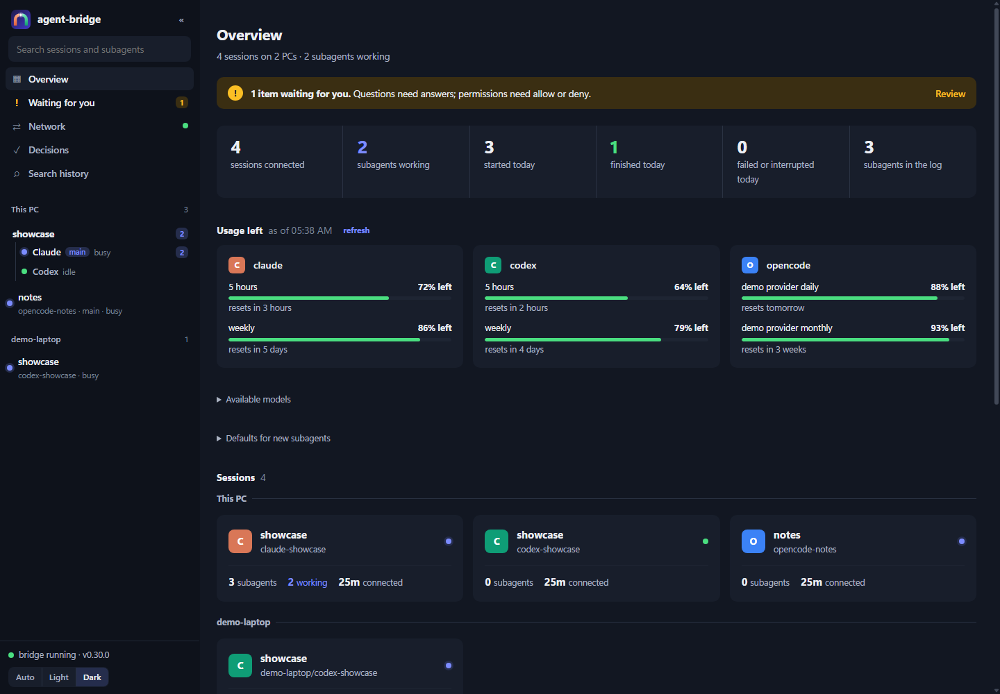
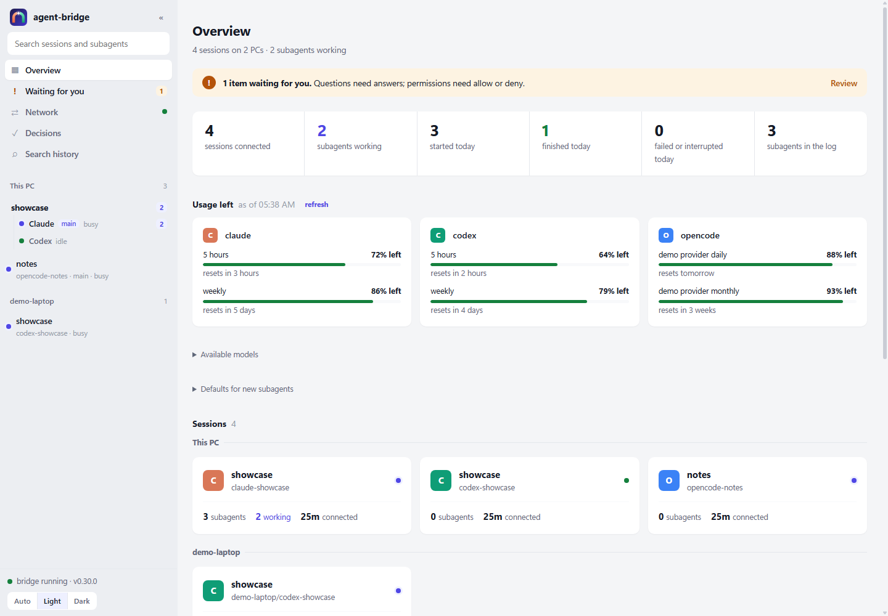
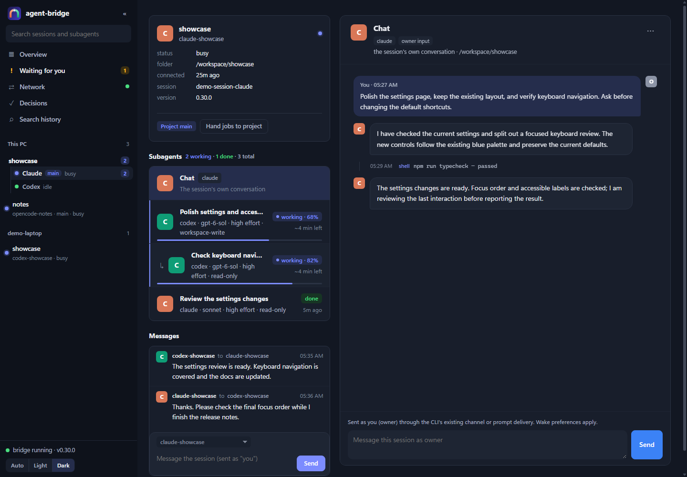
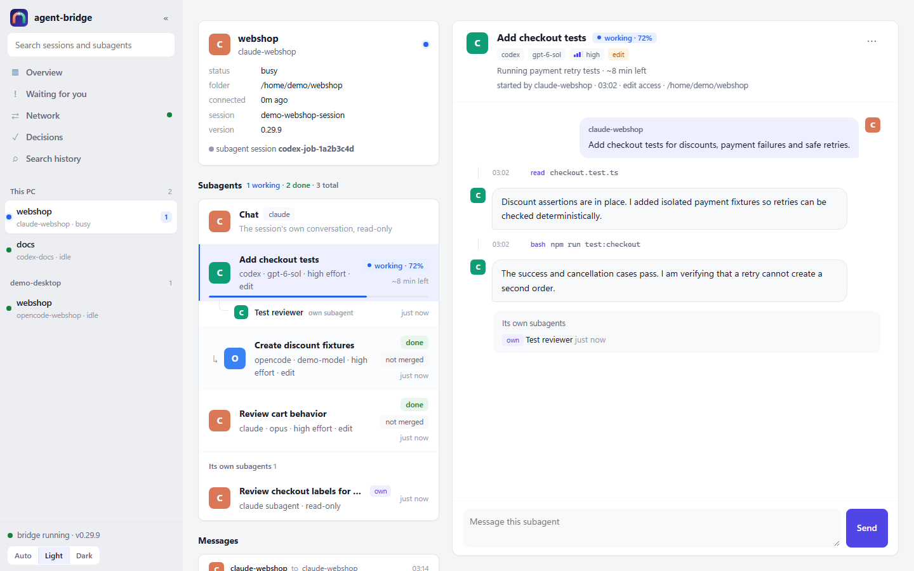
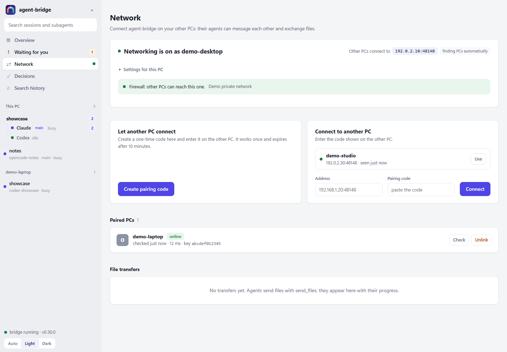
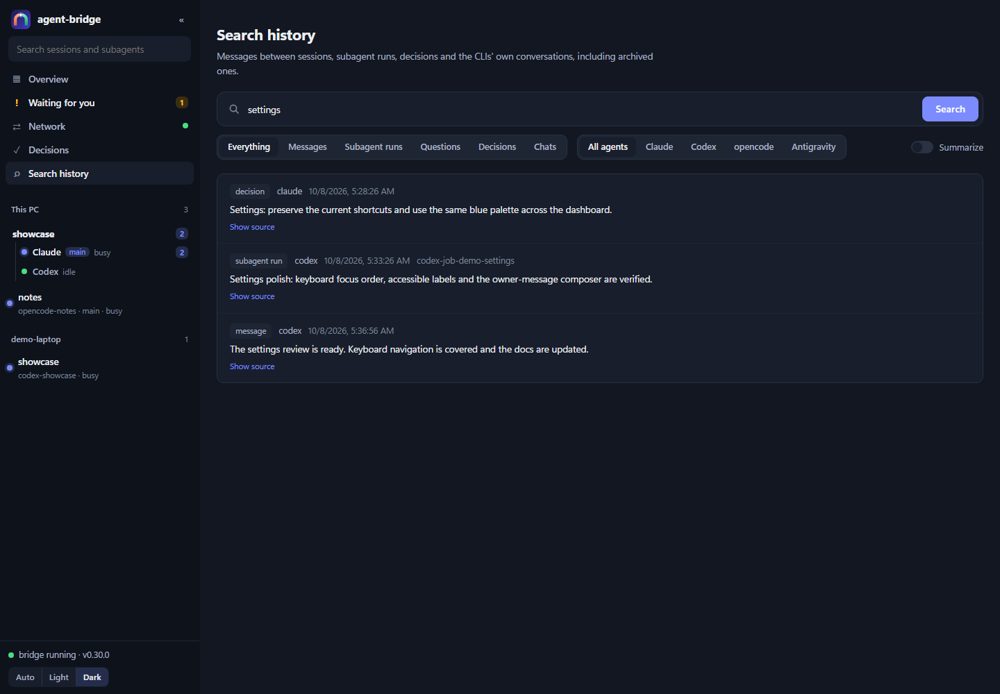

# agent-bridge

**Let Claude Code, OpenAI Codex, opencode and Google Antigravity CLI talk to each other.**

agent-bridge is a set of plugins for Claude Code, Codex, opencode and Antigravity CLI (`agy`), built on a shared core. Agents on the same machine or explicitly paired PCs can:

- **Message each other live.** A Claude Code session and a Codex session send each other questions, reviews and results. Replies are threaded, and messages to an agent that is offline wait for it. Notify-mode waits register once and deliver replies later, surviving reloads and session exit.
- **Delegate.** `ask_<agent>` runs another agent headlessly for a one-off task and returns its answer; for example `ask_codex` and `ask_opencode` from Claude, or `ask_claude` from Codex. You can continue that session later.
- **Spawn each other as subagents.** `spawn_codex` / `spawn_claude` start the other agent in the background and return immediately. The result arrives later as a message, and several subagents can run in parallel.
- **Pick any model.** `ask_*` and `spawn_*` accept any model id or alias the target CLI accepts, for example `gpt-6-sol`, `opus`, or a full Claude model id. Ids are passed through verbatim, so new models work without a plugin update.
- **Follow work in the dashboard.** A sessions sidebar, nested subagent trees, chat bubbles and progress with ETA show who is doing what. Search history, review pinned Decisions, answer approvals in Waiting for you, and manage paired PCs on the Network page.
- **Work across paired PCs.** Pair with TLS and LAN discovery, transfer files, start remote jobs, and read the other PC's chats and subagents through your local dashboard.
- **Coordinate nested jobs.** Subagents can delegate within a shared depth and concurrency budget. Codex jobs can use their own native subagents; exact cross-session messaging grants are opt-in, and finished jobs retain delivery and review outcomes.
- **Keep history.** Messages, jobs, run logs and completed approvals are archived instead of deleted. Backed-up migrations and verified snapshots preserve data across upgrades.

```
 Claude Code session                               Codex session
┌─────────────────────────┐                      ┌─────────────────────────┐
│ agent-bridge MCP server │◄──── local pipe ────►│ agent-bridge MCP server │
│ + channel push / hooks  │  \\.\pipe\… or .sock │ + hooks / codex queue   │
└─────────────────────────┘          │           └─────────────────────────┘
               the first server to start is the broker; messages persist in SQLite
```

There is no daemon to install. Each agent starts its own MCP server. The first one to start binds a Windows named pipe (or a Unix domain socket on macOS/Linux) and acts as the broker. If that process exits, another server takes over automatically. All messages are stored in SQLite under `~/.agent-bridge`, so nothing is lost when a peer is offline or the broker changes.

## Requirements

- Node.js **22.13+** (uses the built-in `node:sqlite`)
- Claude Code (with plugin support) and/or Codex CLI (with plugin support; tested with 0.156)

## Install

### All at once

```bash
npx -y github:rennerdo30/agent-bridge install        # or: install claude codex opencode
```

The installer finds which tools you have. For each one it shows its plan and asks before running it (`--yes` skips the questions). Claude and Codex use official plugin commands; opencode and Antigravity use their documented global plugin folders. Existing user files are preserved. `uninstall` works the same way; for updates see [Updating](#updating).

### Claude Code

```bash
claude plugin marketplace add rennerdo30/agent-bridge
claude plugin install agent-bridge@agent-bridge
```

### Codex

```bash
codex plugin marketplace add rennerdo30/agent-bridge
codex plugin add agent-bridge@agent-bridge
```

Codex does not run plugin hooks until you trust them. Open `/hooks` in a Codex session once and trust the agent-bridge hooks. Without them, messages are only visible when Codex calls the `inbox` tool.

### opencode

```bash
npx -y github:rennerdo30/agent-bridge install-opencode
```

This copies the plugin into opencode's global config (`~/.config/opencode/plugins/`), plus a skill and the `codex` / `claude` subagents. Existing files you created yourself are never overwritten. Restart opencode afterwards. It needs Node.js 22.13+ on `PATH`. Remove it with `npx -y github:rennerdo30/agent-bridge uninstall-opencode`.

In opencode the tools are called `bridge_peers`, `bridge_send`, `bridge_ask_claude`, `bridge_spawn_codex`, and so on. Because opencode plugins can start turns themselves, opencode receives peer messages live, even while idle, whenever its listen window or auto-wake applies.

### Google Antigravity CLI (`agy`)

```bash
npx -y github:rennerdo30/agent-bridge install antigravity --yes
# Later:
npx -y github:rennerdo30/agent-bridge update antigravity --yes
```

Requires installed, authenticated `agy` (verified with 1.2.0 and 1.3.1). Restart it after
installation, and reload existing bridge sessions after updating them. The plugin includes MCP configuration, lifecycle/permission hooks
and a coordination skill. It exposes the same peer, delegation, history and job
tools as the existing plugins. Other peers get `ask_antigravity` and
`spawn_antigravity`, with `model`, `effort` (low/medium/high/xhigh/max), `session_id`,
`access`, `terminal_sandbox`, `bypass_permissions` and `worktree`. Continue with `message_subagent` or
cancel with `cancel_subagent`; these use the existing durable job lifecycle.

`read` denies non-reading tools; `ask` forwards those tool approvals to the
supervisor. Both use the installed bridge gate before every tool, with native
headless prompting bypassed because 1.2.0 otherwise auto-denies approved calls.
`edit` keeps native Antigravity permissions; native headless prompts can deny
commands. Explicit `bypass_permissions: true` runs with native approvals bypassed;
`false` selects native policy. Either exact override replaces read/ask access.
The installer grants only the bridge MCP server and backs up native
settings. Terminal sandboxing is
separate and depends on the installed platform. Active mail arrives at the next
model invocation or stopping boundary. **Idle TUI sessions receive mail on their
next turn or through `inbox`; no public programmatic idle wake API is documented.**
Native Remote Control provides separate desktop/web UI access through a tunnel.
Account quotas are shown by native `/usage` or `/quota`; the bridge reports them
as unknown because no machine-readable quota command is documented.

Native chats and explicit child conversations are read from Antigravity JSONL
logs without modifying them. Installer updates back up replaced files;
uninstall archives the owned plugin, including user additions, and retains
the native MCP allow rule. No bridge data
format changes are required for this additive agent kind.

**Gemini CLI (`gemini`) is separate and is not implemented in this release:** it
was not installed on the verified PC. See [official evidence and CLI differences](docs/google-cli-research.md).

## Updating

```bash
npx -y github:rennerdo30/agent-bridge update     # or: update claude codex opencode
npx -y github:rennerdo30/agent-bridge status     # which sessions still run an old version
```

1. **Keep your sessions running.** `update` publishes immutable versions side by side and preserves every old version. It bypasses Codex's native cache pruning and atomically selects the new cache and marketplace source.
2. New MCP server starts use the selected compatible release. Running servers keep their current code, connections, identity and active work. The updater reports recorded live PIDs and versions; legacy launches are unrecorded. It asks per tool; `--yes` skips the questions. See [live update behavior and limits](docs/live-plugin-updates.md).
3. **Running sessions may keep their old version.** Adopt the new code at a convenient plugin reload or next MCP server start; updating itself does not require a restart. `status` lists every connected session with its agent-bridge version and marks old ones `OUTDATED`:

   ```
   claude-myrepo  [claude, busy, v0.29.8 OUTDATED]  since …  /home/demo/myrepo
   codex-myrepo   [codex, idle, v0.29.9]            since …  /home/demo/myrepo
   1 session(s) run an older agent-bridge than 0.29.9. They can keep working; a plugin reload or the next MCP server start loads the selected compatible update.
   ```
4. In Codex, check `/hooks` after an update. Newly added agent-bridge hooks, such as the `PermissionRequest` hook in 0.5.0, must be trusted once.

Compatible versions can run together. Since 0.10.0 the bridge's pipe name includes the wire protocol, so sessions of incompatible versions run separate bridges instead of locking each other out. They don't see each other until they adopt compatible code. The same applies to sessions from before 0.10.0.

## Usage

Just ask in plain language, for example:

> Ask Codex to review the diff in `src/auth` and wait for its answer.

> Send the Codex session a summary of the API we agreed on.

> Get a second opinion from Claude on this migration plan. *(from Codex)*

### Tools (both agents)

| Tool | What it does |
|---|---|
| `peers` | Who is online (busy or idle, uptime, session id), your own name and settings, and every running delegation (background jobs and blocking `ask_*` calls) with its runtime and current step |
| `send` | Message a peer: `to` = peer name, `claude`/`codex` (if exactly one is online) or `*`; `reply_to` threads answers |
| `wait_for_message` | Register once for a matching reply and return immediately; short blocking waits remain available |
| `inbox` | Read unread messages |
| `ask_claude` / `ask_codex` / `ask_opencode` / `ask_antigravity` | Headless delegation to another agent (every agent gets the other coding agents); waits and returns the answer and a `session_id` to continue |
| `spawn_claude` / `spawn_codex` / `spawn_opencode` / `spawn_antigravity` | Same, but as a background subagent: returns a job name at once; the result arrives as a message from `<agent>-job-<id>`; `peers` shows each job's current step |
| `message_subagent` | Talk to a subagent started with `ask_*` or `spawn_*`: a running one gets the message while it works and answers right away; a finished or failed one continues in its own session with its full context (see below) |
| `usage_limits` | How much of each agent's account limits is used (Codex and Claude: 5-hour and weekly windows with reset times; opencode: today's spend and which models are free), so the driving agent can pick who gets large work |
| `cancel_subagent` | Stop a running subagent (background job or blocking `ask_*` run) by its job name |
| `report_progress` | A delegated job reports `percent`, a short `note` and optional `eta_minutes`; its supervisor and dashboard see the estimate |
| `set_job_outcome` | Record a finished job as held (with a reason) or discarded; delivery/read receipts and Git merge evidence are tracked separately |
| `search_history` | Search messages, runs, decisions and CLI chats, including archives; optional sourced summaries use a model |
| `decide` / `decisions` | Record and retrieve scoped owner decisions, retaining every revision |
| `auto_wake` | Let incoming messages make this session keep working (see below) |

`ask_*` and `spawn_*` take these parameters:

- `title` (required for `ask_*`, optional for `spawn_*`): a short name for the job, 3-7 words, like a chat title. The dashboard and `peers` show it. If omitted, spawn tools derive one from the prompt and report the fallback. Other parameters below are optional.

- `model`: any id or alias the target accepts, passed through verbatim. For opencode, short or partial names like `muse-spark` are resolved against `opencode models`. An ambiguous or unknown name fails immediately and lists the candidates.
- `effort`: reasoning effort, e.g. `low`, `medium`, `high`, `xhigh` (Claude also `max`; for opencode the model's variant). Passed as Claude `--effort`, Codex `model_reasoning_effort` and opencode `--variant`. Without it the config's `effort` applies (`"high"` for every subagent, or per target: `{ "codex": "xhigh", "claude": "high" }`), else the CLI's own default. The dashboard shows the effort each subagent runs at: the one asked for, what Codex reports for its thread, or the default from the Claude or Codex config.
- `session_id`: continue an earlier run. `cwd`: working folder. `host`: run the job on a paired PC; see [remote jobs](docs/remote-jobs.md).
- `native_subagents` (Codex): how many of Codex's own child threads a job may run, default 6, range 0–32; 0 disables them. This is separate from bridge delegation depth and concurrency.
- `send_to`: opt-in messaging to exact local sessions or jobs outside the supervisor's siblings; see [cross-session job messaging](#exact-cross-session-job-messaging).
- `timeout_sec`: 60 minutes by default for `ask_*`; background `spawn_*` jobs have no practical limit (24 hours). A run that times out is not lost: the error names its session (`call again with session_id="…"`), so the caller continues it instead of starting over. The relay subagents do that automatically, once.
- `access` and `worktree`, see below.
- Target-specific options: `sandbox` and `approvals_reviewer` for Codex, `permission_mode` for Claude, or `auto_approve` for opencode. Codex uses `approvals_reviewer: "auto_review"` (Approve for me) by default; `"user"` forwards approval requests directly. Headless opencode rejects every permission request unless `auto_approve` is set.

Peer names default to `<agent>-<project folder>`, for example `codex-myrepo` (`<agent>-session` until the folder is known; a bare `codex` always means "the codex peer"). Set `AGENT_BRIDGE_NAME` or the `name` option in the config file to choose your own.

### Slash commands (Claude Code)

`/agent-bridge:dashboard`, `/agent-bridge:peers`, `/agent-bridge:inbox`, `/agent-bridge:send <to> <message>` and `/agent-bridge:delegate <codex|opencode> [model=<id>] [edit] [worktree] <task>`.

### Editing subagents: access and worktrees

- `access: "read"` (the default) lets a delegated agent look but not change anything. `access: "ask"` asks you for each change (see below). `access: "edit"` lets it change files.
- A subagent started in an existing agent-bridge worktree (`cwd` inside `~/.agent-bridge/worktrees`) gets `access: "edit"` by default. The spawn result always says which access a job has.
- `worktree: true` runs the subagent in its own git worktree on a branch `agent-bridge/<id>`. Your working copy stays untouched. The result shows a diff summary and the exact commands to review, merge (`git merge agent-bridge/<id>`) or discard the changes. Use it for parallel or risky edits. The review diff covers only the job's own work: if the job merged a newer state of its base branch (or of your main checkout's branch) into its branch, the diff starts from there. agent-bridge creates the worktree itself (as you, never inside the agent's sandbox) and leaves it unlocked.
- Finished worktrees stay by default. `agent-bridge cleanup` lists safe removals; optional `jobCloseCleanup` pushes all job commits before reaping a clean, proven checkout. [Checkpoint identity, Windows permission repair and close policy](docs/worktree-lifecycle.md).
- Delegated jobs report in their final answer; the session that started them owns the project handoff. Their task says so, their calls to handoff tools (any MCP tool named `*set_handoff` or `*update_handoff`, e.g. Pair Desk's) are declined without asking you, even with `allow_tools`, and the result warns when a job changed `HANDOFF.md` or `TODO.md` anyway.
- Results also list the files changed in place (for `access: "edit"` without a worktree) and the token usage or cost the CLI reported.

How `read` is enforced per agent:

| Agent | read | edit |
|---|---|---|
| Codex | `read-only` sandbox, with eligible escalations reviewed by `auto_review` | `workspace-write` sandbox with the same reviewer |
| opencode | an extra config layer turns edits and shell commands into "ask", which headless runs reject | your own opencode rules; what they leave to "ask" goes to the parent (see Approvals below), or `--auto` when no one can answer |
| Claude | editing and shell tools removed (`--disallowedTools`); Read, Grep and Glob stay | `acceptEdits`; permission prompts go to the parent (see Approvals below) |

Codex automatic review can approve an eligible escalation beyond a read-only sandbox. Select `approvals_reviewer: "user"` for direct supervision; use Codex managed requirements for hard restrictions. Headless Claude wrote files and ran commands even in `manual` mode in testing, and opencode's default rules allow everything. `agent-bridge reliability` checks delegated access separately from automatic review.

Read-only also covers MCP tools, which can change things too: a read-only Claude subagent gets every configured MCP server denied (plugins, `~/.claude.json`, the project's `.mcp.json`, claude.ai connectors) except agent-bridge's own, so it can still answer you; read-only opencode subagents keep only `bridge_send` of all MCP tools. Codex automatically reviews eligible MCP approvals, forwarding refusals and remaining client requests to its supervisor.

Codex edit jobs in a linked git worktree may write that worktree's git data in the main repository (`.git/worktrees/<name>` and the shared `.git`), so they can commit on their own branch. Work a subagent leaves uncommitted is committed for it with a subject taken from its answer and a `Co-Authored-By` line naming the agent and model.

Worktree commits use the parent repository's effective `user.name` and `user.email` (local or global Git config). Only missing identity fields fall back to `agent-bridge <agent-bridge@localhost>`.

Codex worktree edit jobs honor `codexWorktreeSandbox` in `~/.agent-bridge/config.json`. When it is unset, they inherit `codexSandbox`, except that its safe `read-only` default becomes `workspace-write` for worktree edits. Explicit `access: "read"` or `"ask"` stays read-only, and an explicit `sandbox` wins. Plain jobs retain their read-only default. The same rules cover continued worktrees and a worktree passed as `cwd`.

Set `codexApprovalsReviewer: "auto_review"` (default) or `"user"` in bridge config. Override it with `approvals_reviewer` on `spawn_codex`, `ask_codex`, or `message_subagent`; continuation settings persist and apply from the next turn. Automatic review changes who reviews eligible requests, while preserving the selected sandbox. Refusals and timeouts pause the job and enter the supervisor/dashboard approval queue. The supervisor decision becomes context for a continuation in the same thread; an allow requests one exact retry, still subject to Codex policy. Tool allowlists and cached MCP allows do not automatically approve these refusals. Without someone to answer, the refusal is reported explicitly. Full access keeps its existing command/edit behavior and MCP approval checks. The legacy `codex exec` fallback retains its existing approval handling because it lacks review notifications. See [delegated access](docs/delegated-access.md#automatic-approval-review-ab-92) for protocol details and limitations. No owner Codex config is changed.

For dependency downloads with `workspace-write`, set `codexWorkspaceWriteNetworkAccess: true` in bridge config. This forwards Codex's `sandbox_workspace_write.network_access` setting to both app-server and exec. When unset, Codex's own config controls workspace network access; read-only runs remain restricted. Network access alone does not grant access to external build caches or user configuration such as `NuGet.Config`.

For trusted build jobs needing those paths, set `codexWorktreeSandbox: "danger-full-access"` or pass that exact `sandbox` per job. This removes filesystem and network restrictions. On Windows, the elevated sandbox can also delay every command for minutes in worktrees under the user profile; this was observed even for `pwd` and `echo`, and disappeared when the job restarted without the sandbox. Choose full access explicitly for such jobs rather than changing the read-only default.

A read-only Claude subagent therefore cannot run shell commands such as `git diff`. Give it `access: "edit"`, ideally with `worktree: true`, if it needs them.

### Permission requests from subagents: `access: "ask"`

With `access: "ask"` a subagent starts read-only. Whenever it wants to change a file or run a command, you get an Allow / Deny dialog in the session that started it. That dialog is your host's native MCP dialog, in Claude Code or Codex. Your answer goes back to the subagent. Dismissing the dialog, not answering within 10 minutes, or any error counts as Deny. The result lists every request and your decision.

| Subagent | Forwarding | How |
|---|---|---|
| opencode | yes | agent-bridge runs a private `opencode serve` (127.0.0.1, random port and password) and answers its permission events |
| Codex | yes | Codex runs through `codex app-server`, which hands its approval questions to agent-bridge. With `AGENT_BRIDGE_CODEX_EXEC=1` (plain `codex exec`) the agent-bridge `PermissionRequest` hook asks your session instead. Trust it once via `/hooks` in Codex. Without that trust entry, Codex subagents run strictly read-only, so Codex's automatic reviewer never decides on its own. If a Codex run ever changes files without the hook asking, agent-bridge warns and switches that hook version back to read-only (fail closed). |
| Claude | not yet | `ask` runs read-only. A `PermissionRequest` hook only sees what would show a dialog; your allow rules or auto mode approve edits and commands before that, so "every change is asked" could not be guaranteed |

The parent session must support MCP elicitation dialogs; Claude Code and Codex do. If it doesn't, every request is denied.

### Talking to subagents: follow-ups and recovery

Every `ask_*` and `spawn_*` run is a job with a name like `codex-job-1a2b3c4d` or `opencode-ask-9f8e7d6c`, and it keeps its own session. So you can talk to it like a native subagent:

- **Follow up:** `message_subagent(job="codex-job-1a2b3c4d", message="now add tests")` continues the same Codex thread, Claude session or opencode session with its full context, in the same folder or worktree. The answer arrives as a message from the job.
- **While it runs:** the message reaches it at its next step, like with a native subagent, and it answers right away (for example "how far are you?", or "skip the docs, focus on the tests"). Its answer arrives as a message from the job. Codex gets the message as real user input in its running turn (agent-bridge drives Codex through `codex app-server` for this); Claude and opencode get it through agent-bridge's hooks and plugin. A message that arrives just as it finishes is sent as a follow-up instead.
- **Recover:** if a run failed, timed out or was interrupted, `message_subagent(job=...)` without a message tells it to continue where it stopped. The failure message says so and names the job.
- **Change settings:** `message_subagent(job=..., model="...", access="edit", message="continue")` saves the model and permission level for the next turn and later continuations. Exact permissions use `sandbox` for Codex, `permission_mode` for Claude, or `auto_approve` for opencode. Codex reviewer settings use `approvals_reviewer` and persist independently of access. Changing `access` clears an earlier exact override; an exact override takes precedence when supplied together. Settings survive restarts and reach detached runners. The running turn keeps its settings; dashboard model and permission chips reflect the settings of each turn. A live message does not restart that turn. To apply changes immediately, cancel it and continue the same job with the new settings.

- **After a restart:** jobs are saved in `~/.agent-bridge/jobs.json` (the last 200, small), so a restarted session can still continue them with `message_subagent`. Jobs that were running when the session ended show as interrupted; `message_subagent(job=...)` without a message recovers them in their own session, folder and worktree, with the same access.
- **Survive `/reload-plugins`:** each background subagent (spawn_* and its follow-ups) runs in a detached `agent-bridge job-runner` process, not inside the session's MCP server. A reload or restart of the server leaves it running; the next server of the session takes it over (progress, `message_subagent`, approvals, `cancel_subagent`) and gets its result as usual. If the session is gone for good, the result waits for the next session with that name. Only a job whose runner died shows as interrupted. Blocking ask_* runs and access="ask" runs (their questions go to the user through the server) still end with the server. `AGENT_BRIDGE_JOB_RUNNER=0` runs every subagent inside the server instead.
- **Command lifetime:** a native command can fail while its job continues. Codex command failures retain their item ID, exit/status and reported timeout evidence in run progress and logs; an unattributed exit is labelled `termination cause not reported`. Detached tools are not automatically independent of tree cancellation. See [command lifetime and durable tools](docs/command-lifetime.md).
- **Approvals:** when a background subagent needs approval, the question goes to the agent that started it as a message: "codex-job-… asks for approval: …". Codex automatically reviews eligible approval requests first; refusals and requests left to the client reach the supervisor/dashboard. opencode with `access: "edit"` asks for whatever your opencode rules leave to "ask" (MCP tools you marked, folders outside the project, commands you marked); agent-bridge runs it through a private `opencode serve` for that instead of `opencode run --auto`, which approved all of it. Claude with `access: "edit"` asks for every permission prompt (a command or MCP tool your rules don't allow) through a `PermissionRequest` hook that agent-bridge adds with `--settings`; Claude Code before 2.1.268 does not run that hook in `-p` mode. Claude and opencode read-only runs keep their deny rules; Codex read-only escalation requests can be reviewed or forwarded. The agent answers explicitly with `decide(approval_id=..., decision="allow")` or `decision="deny"` (or in the dashboard). Plain `message_subagent` text, including `allow` or `deny`, never answers an approval and the result mentions any pending approval, so this works in auto mode and while you're away; no answer within 10 minutes counts as deny. One allow covers that MCP server for the rest of the run. A blocking `ask_*` caller can't answer while it waits, so those questions are shown to you instead; if your host can't show dialogs, opencode and Claude keep their old behavior (`--auto`, and Claude's own handling of prompts). For Codex direct user approval, combine `access: "ask"` with `approvals_reviewer: "user"`; the default automatic reviewer still applies to ask jobs.

- **Progress:** subagents report `percent`, a short `note` and optional `eta_minutes` with `report_progress`; `peers` and the dashboard show the progress and time left. Both are the subagent's own estimates.
- **Read-only tools without asking:** list MCP tools that subagents may call without an approval question, as `server.tool` patterns with `*`: `"autoApproveTools": ["pair-desk.get_*", "pair-desk.list_*"]` in the config (or `AGENT_BRIDGE_AUTO_APPROVE_TOOLS`, comma-separated), or `allow_tools=[...]` on a single `spawn_*` / `ask_*`. An "allow" answer covers that MCP server for the rest of the job, follow-ups included.
- **Desk workers:** `allow_tools=["pair-desk:worker"]` allows `get_*`, `list_*`, `comment`, `progress`, `set_plan`, `update_step`, `create_issue`, `update_issue` and `set_location`. It excludes status changes, build publication and handoff writes. Add `"pair-desk.set_build"` separately when a job should publish a build. Read patterns alone do not allow plans or issue edits.
- **Capacity errors:** jobs retry model-capacity failures after 15, 30 and 60 seconds within their original time limit, preserving the session and selected model. No model fallback is used. The step log records each retry.
- **Denial reasons:** supervisor denials identify the supervisor and carry its reason. Claude hooks and opencode replies pass it in their protocol response; Codex approval responses have no reason field, so the running turn receives a live explanation. Bridge policy refusals identify agent-bridge separately.

### Shared resource slots

To limit heavy commands across parallel jobs and projects, opt in with a top-level config entry:

```json
{ "resourceSlots": { "unity": 2, "gpu": 1 } }
```

All jobs using the same `AGENT_BRIDGE_HOME` share these capacities; per-agent sections cannot override them. Jobs receive slot instructions in their preamble and a stable owner identity in their environment. Around a heavy command, use `agent-bridge slot acquire unity` and always `agent-bridge slot release unity` in a `finally` block or shell trap. The preamble gives the bundled CLI path when `agent-bridge` is not on PATH. For example, in PowerShell:

```powershell
agent-bridge slot acquire unity
if ($LASTEXITCODE -ne 0) { throw "Could not acquire Unity slot" }
try { & $unityEditor -batchmode -quit -projectPath $projectPath }
finally { agent-bridge slot release unity }
```

`agent-bridge slot status` prints holders and FIFO waiters as JSON. SQLite file locks in `resource-slots.sqlite` serialize acquisition across processes and recover automatically after a crash; no extra daemon or dependency is needed. Dead owner processes are reclaimed on the next acquire or status call. Runs renew their six-hour leases every minute and release all their slots when the run ends. Outside a delegated job the owner defaults to the calling shell process; keep that shell alive and use `agent-bridge slot renew unity` before its six-hour lease expires. Acquiring twice is idempotent: one job holds one slot per resource. Lowering a capacity leaves current holders in place and blocks new acquisitions until usage falls below the new limit.

Slots are cooperative: commands that skip acquisition remain unrestricted. Queue inspection is available through `slot status`; dashboard and `peers` integration are not included.
- **Nested delegation:** a top session is depth 0. With `maxDelegateDepth: 2` (default, range 1–3), its children can start another generation. Every generation shares the root session's `maxJobs` budget; results return to the direct parent. See [nested delegation](docs/nested-delegation.md).
- **Results reach the right agent:** messages are not handed to Claude Code's native subagents (Task/Agent tool) through their tool calls; they wait for the main agent. After `/reload-plugins` the new agent-bridge server of a session replaces the old one and keeps its name.
`peers` lists running jobs and the recent finished ones. This works the same whichever agent is the host (Claude Code, Codex or opencode, where the tool is `bridge_message_subagent`) and whichever is the subagent. Cancelling or ending a session stops its subagents with their whole process tree.

### Exact cross-session job messaging

Jobs are isolated from other sessions by default. At spawn, a session can opt in with
`send_to: ["opencode-job-12345678"]` (or an exact local session name). Each direction needs
its own grant: the other job must include the sender's exact name in its `send_to` to reply.
`peers` lists granted jobs alongside siblings with their titles and status. Wildcards,
agent kinds, and paired-PC addresses are rejected; granting a session does not grant its jobs.
Grants persist across continuations, and cross-session job threads keep the sibling hop
limit and durable undelivered-text notices. Both owners retain quiet inbox/dashboard copies;
these copies do not enter their context automatically. Finished jobs return their saved
report immediately: do not wait for a reply or receipt unless their owner continues them.

## Native subagents

Where the host lets plugins define subagents, agent-bridge ships them. Each one is a thin relay that hands the task to the other agent and returns its answer. Because they are the host's own subagents, you get its subagent UI, background runs, parallelism and cancellation.

| Host | Subagents | How to use |
|---|---|---|
| Claude Code | `agent-bridge:codex`, `agent-bridge:opencode` (bundled in the plugin, run on Haiku) | "use the codex subagent to review this diff", or `@agent-agent-bridge:codex` |
| opencode | `codex`, `claude` (installed by `install-opencode`) | "use the codex subagent …", or `@codex` |
| Codex | none: Codex plugins can't ship agent roles, and Codex's current `spawn_agent` has no role parameter | use `spawn_claude` / `spawn_opencode` (background jobs, see below) |

### Following a delegated run

While a delegated run works, agent-bridge streams every step as an MCP progress notification. Each line carries the elapsed time, a step counter with totals, and what the agent is doing or saying:

```
2m · step 14 (6 cmds, 3 edits) · bash: py scripts/run-domain-tests.py
3m · step 14 (6 cmds, 3 edits) · says: Rooms per building type are in, now the furniture kit.
still working, no new step for 4m (last: bash: py scripts/run-domain-tests.py)
```

The "still working" heartbeat comes after every minute without a new step, so long test runs or thinking phases don't look like a hang. Claude Code shows these lines under the running tool call (`Ctrl+O` expands them). Codex currently ignores MCP progress.

### Web dashboard

The dashboard starts automatically: whichever agent session hosts the bridge also hosts the dashboard at `http://127.0.0.1:4777`, and if that session ends, another one takes it over. To open it:

- `/agent-bridge:dashboard` in Claude Code (or ask any agent to "open the agent-bridge dashboard"), or
- from any terminal:

  ```bash
  npx -y github:rennerdo30/agent-bridge ui     # opens the running dashboard, or starts one if no agent runs
  ```

Turn the automatic start off with `"dashboard": false` in `~/.agent-bridge/config.json` (or `AGENT_BRIDGE_DASHBOARD=off`); change the port with `"dashboardPort"`.

The dashboard has a **sessions sidebar**, grouped by PC, with search and folding:

- **Overview:** connected sessions, usage left, working and finished jobs, and message history with a box to send a message yourself (as "you"). Finished jobs show merge/review outcomes.
- **Session page:** its own read-only chat and a subagent tree with nested bridge jobs and the CLIs' own subagents. Conversations use chat bubbles; commands fold into rows, and follow-ups stay in the same job. Progress and ETA appear in the job row and conversation header. Older finished runs fold into an archive and remain readable.
- **Search history:** search messages, subagent runs, Decisions and CLI chats, including archived history; filter by kind or agent, inspect sources, or opt into a model-generated summary.
- **Decisions:** pinned owner choices with scope and revision history.
- **Waiting for you:** pending approvals with countdowns and allow/deny controls, plus optional browser notifications.
- **Network:** pairing, discovery details, connection checks, firewall guidance and file-transfer progress. Paired sessions appear in the sidebar, with their chats and subagents readable over the authenticated link.

These screenshots use synthetic demo data only.

| Overview · dark | Overview · light |
|---|---|
|  |  |

| Session · dark | Session · light |
|---|---|
|  |  |

| Network | Search history |
|---|---|
|  |  |

It only listens on 127.0.0.1. Its link contains a secret (stored in `~/.agent-bridge/dashboard.json`, readable only by you on Unix); without it the dashboard refuses every request, also from other local programs and web pages. `ui` options: `--port=N`, `--no-open`.

Local sessions also have read-only transcript APIs for their normal chat and their CLI's native subagents: Claude Code JSONL, Codex rollout JSONL, and OpenCode SQLite. They use the peer's session id, the same dashboard cookie, and bounded incremental reads. CLI files are never edited. `CLAUDE_CONFIG_DIR`, `CODEX_HOME`, and OpenCode's `XDG_DATA_HOME` storage override are respected. Paired-PC reads use the existing TLS link; update and restart hosting sessions on both PCs. See [the transcript API](docs/transcripts.md) and [paired dashboard reads](docs/remote-dashboard.md).

### Run logs

Every run also writes a step-by-step log to `~/.agent-bridge/runs/`, whose path is in the result. Follow a run live from any terminal:

```bash
npx -y github:rennerdo30/agent-bridge watch            # the newest run
npx -y github:rennerdo30/agent-bridge watch opencode   # the newest opencode run
```

opencode subagents keep opencode's full tool set on purpose, because opencode's free tier rejects subagents with a restricted tool list. Their prompt tells them to only relay.

## How messages reach a session

| | Claude Code | Codex |
|---|---|---|
| While the agent is working | injected after each tool call (`PostToolUse` hook) | same |
| On your next prompt | injected (`UserPromptSubmit` hook) | same |
| When the agent finishes a turn (auto-wake on) | `Stop` hook keeps it going | same |
| While the session is idle | **live push via channel** (see below) | auto-wake runs `codex queue`, which starts a turn |

opencode receives messages through its plugin: after each model step while it works, and by starting a turn itself when it is idle.

### Live push into Claude Code (channels)

Claude Code [channels](https://code.claude.com/docs/en/channels) let the agent-bridge MCP server push peer messages straight into a running session, even an idle one. Channels are a research preview, and custom channels must currently be loaded with the development flag:

```bash
claude --dangerously-load-development-channels plugin:agent-bridge@agent-bridge
```

agent-bridge detects this flag on its parent process and switches to channel delivery automatically. You can force a mode with `AGENT_BRIDGE_DELIVERY=channel|hooks`.

### Waiting for results and replies

**Claude Code:** a turn never waits. When a Claude session has background subagents running (`spawn_*`), or has asked a peer a question, its turn ends normally and you can keep working. A background hook (Claude Code's `asyncRewake`) waits instead. When a subagent result or the reply arrives, it wakes the session with it. Direct messages from another session wake idle Claude by default, including messages from a paired PC. Set `"wakeOnDirect": false` to queue them for its next turn. Broadcasts, agent-kind targets and status `:note` messages do not trigger this direct wake; broadcasts and agent-kind messages need auto-wake. The hop limit always applies.

**Codex and opencode** use a listen window instead. After such a session sends a bridge message or spawns a subagent, its `Stop` hook keeps the turn open for up to `lingerSec` seconds (default 300) waiting for the reply. Press Esc to stop listening early, or set `lingerSec` to `0` to disable it.

`send` reports inbox delivery separately from wake policy. A read receipt is available with
`wait_for_message(read_receipt_of=<sent message id>)`, locally and across paired PCs. It confirms
consumption by the bridge's hook, tool or channel, not that the agent completed the work.
`wait_for_message(mode="notify", reply_to=<sent id>)` registers a durable one-shot wait and
returns immediately. This is the default for incoming messages. Keep working or end the turn;
do not repeat the call. A queued match is returned immediately; a later match uses the existing
wake/channel paths without enabling global auto-wake. If the host cannot wake, the session is
offline, or a quiet/hop guard applies, mail stays queued for the next hook or inbox call.
Subscriptions survive `/reload-plugins` and session exit and finish only when matching mail is
consumed. `peers` and `SessionStart` show armed waits and their `resume_id`.

`mode="block"` retains the 110-second cap below the host's 120-second background threshold.
A blocking message timeout automatically arms notify instead of requesting another wait.
For compatibility, `timeout_sec` without `mode` selects block; `read_receipt_of` and nested
child waits support block only. Existing interrupted blocking waits retain their filters and
can resume as before, or convert with `wait_for_message(resume_id=<id>, mode="notify")`.
Cancel a saved wait with `mode="cancel"` and `resume_id`; its record is archived, mail untouched.
See [notification-wait design and tradeoffs](docs/message-waits.md).

### Auto-wake and loop protection

Auto-wake is **off by default**. Turn it on per session by asking the agent ("turn on agent-bridge auto-wake"), or globally with `"autoWake": true` in the config.

Every reply increments a conversation's hop count. Messages at or above `maxHops` (default 6) never wake an agent; they are still shown on the next prompt. Delegated sessions retain parent/sibling messaging restrictions and the configured delegation-depth limit.

## Configuration

`~/.agent-bridge/config.json` (all keys optional; per-agent sections override the top level; env vars override both). Running sessions pick up changes within a few seconds; `name`, `delivery` and the dashboard port need a restart; use the connect wizard to reload `network` settings live:

```json
{
  "autoWake": false,
  "wakeOnDirect": true,
  "maxHops": 6,
  "maxJobs": 8,
  "maxDelegateDepth": 2,
  "autoApproveTools": ["pair-desk.get_*", "pair-desk.list_*"],
  "codexApprovalsReviewer": "auto_review",
  "codexSubagents": 6,
  "lingerSec": 300,
  "codex": { "name": "codex-main", "claudeBin": "claude", "claudePermissionMode": "default", "claudeModel": "opus" },
  "claude": { "delivery": "auto", "codexBin": "codex", "codexSandbox": "read-only", "codexModel": "gpt-6-sol" },
  "opencodeModel": "anthropic/claude-sonnet-5",
  "opencodeAutoApprove": false
}
```

`codexSubagents` sets the default native Codex child-thread budget per delegated job
(6 by default, integers 0–32; 0 disables). Override it with `native_subagents` on
`spawn_codex`, `ask_codex` or `message_subagent`. This is separate from bridge job
concurrency and delegation depth. See [native subagent settings and dashboard APIs](docs/codex-subagents.md).

| Env var | Meaning |
|---|---|
| `AGENT_BRIDGE_HOME` | Data directory (default `~/.agent-bridge`) |
| `AGENT_BRIDGE_NAME` | Peer name |
| `AGENT_BRIDGE_AUTO_WAKE` | `on` / `off` |
| `AGENT_BRIDGE_WAKE_ON_DIRECT` | Wake idle Claude for messages addressed to its session name (default `on`); `wakeOnDirect` in config |
| `AGENT_BRIDGE_MAX_HOPS` | Loop limit |
| `AGENT_BRIDGE_MAX_JOBS` | Subagents running at once per top-level session, including blocking asks and every nested generation (default 8, max 50); `maxJobs` in the config file. Continuing a finished subagent while all slots are taken queues it; it starts when one frees up. Mid-session, ask the top supervisor to change it ("allow 10 subagents"): the `max_subagents` tool applies it at once, with `save=true` also for new sessions |
| `AGENT_BRIDGE_MAX_DELEGATE_DEPTH` | Maximum delegation depth (`maxDelegateDepth` in config), default 2, allowed range 1–3. A top session has depth 0; its child has depth 1 and can start depth 2 children. Every generation shares the top session's subagent budget. |
| `AGENT_BRIDGE_LINGER_SEC` | Listen window after sending (0 disables) |
| `AGENT_BRIDGE_DELIVERY` | Claude only: `auto`, `channel`, `hooks` |
| `AGENT_BRIDGE_CLAUDE_BIN` / `AGENT_BRIDGE_CODEX_BIN` / `AGENT_BRIDGE_OPENCODE_BIN` | Paths of the CLIs used for delegation |
| `AGENT_BRIDGE_LOG_LEVEL` | File log level: `debug`, `info` (default), `warn`, `error`, `silent` |
| `AGENT_BRIDGE_LOG_CONSOLE` | stderr log level (default `warn`) |
| `AGENT_BRIDGE_PIPE` | Override the pipe / socket path |

Logs are written to `~/.agent-bridge/logs/agent-bridge.log`.

### Stored data and upgrades

History is **archived, never automatically deleted**: messages, jobs, run logs, completed
approvals and wait records remain available after maintenance. `agent-bridge doctor` checks
storage; `doctor --backup` creates a verified snapshot. See [storage and recovery](docs/storage.md).

`bridge.db` uses SQLite `PRAGMA user_version` (currently schema 6), with ordered migrations
for messages, decisions, history search and session identity. Unversioned databases upgrade through version 1. Pending
migrations run in order in one transaction, after a consistent SQLite backup (including committed
WAL data). Opening a newer schema fails without changing it. Three recent `.backup-*` copies
stay beside the store; older backups move into `archive/` and are never deleted automatically.

JSON stores use `version: 2`. Legacy config, preferences, jobs and runner state remain readable;
the first upgraded write backs up the old file. `jobs.json` is now `{ "version": 2, "jobs": [...] }`;
`auto-wake.json` keeps preferences under `peers`. Unknown fields survive updates. Writes replace
files atomically and refuse newer versions. Corrupt JSON moves to `.corrupt-<time>-<id>` with a
warning, preserving its original bytes. Other read errors prevent replacement rather than treating
an unreadable file as empty.

Retention controls are environment variables (nonnegative integers; `0` disables pruning):

| Env var | Default | Retention behavior |
|---|---|---|
| `AGENT_BRIDGE_MESSAGE_TTL_MS` | `604800000` (7 days) | Expired messages move into separate `archive.db` before removal from the primary |
| `AGENT_BRIDGE_QUEUED_MAIL_MAX_AGE_MS` | `86400000` (1 day) | Stale queued messages move into `archive.db` before a peer claims mail |
| `AGENT_BRIDGE_JOB_STORE_LIMIT` | `200` | Finished jobs beyond the limit move into `archive/jobs.json.overflow.json-*`; running and interrupted jobs stay active |
| `AGENT_BRIDGE_RUN_LOG_LIMIT` | `50` | Older finished logs and their metadata move into `runs/archive/`; unfinished feeds stay active |
| `AGENT_BRIDGE_RUNNER_KEEP_MS` | `604800000` (7 days) | Old finished runner state/spec files move into `jobs/archive/`; running state stays active |

Archived messages remain visible in history and searchable through the authenticated history API.
Archived jobs remain continuable, and archived run logs stay readable in the dashboard and `watch`.
Legacy `archived_messages` rows move into `archive.db` without changing the primary schema;
the archive has its own versioned migrations. Retain these archives with your normal backups;
they have no automatic size cap. Runner specs are archived
after consumption and earlier runner state is archived before a new turn starts. Stored job prompts
are retained in full; only displayed previews and the in-memory recent-job list are bounded.

### Paired PCs

Networking is **off by default**. Pair two PCs once, then their agents can message each other, send files and start remote jobs. Your local dashboard can also read the other PC's chats, bridge jobs and native subagents. Start an agent-bridge session (Claude Code, Codex or opencode) on each PC first.

**In the dashboard** (`agent-bridge ui`, page **Network**):

1. On both PCs: name the PC, keep "Other PCs on this network" and press **Turn on**. If the firewall blocks other PCs, the page says so; on Windows **Open the ports…** shows the rules and adds them after you confirm and accept the administrator prompt. macOS and Linux show the commands to run yourself.
2. On one PC: **Create pairing code**. The code is copied to the clipboard and is valid once, for ten minutes. The page shows the address the other PC should use and turns to "Connected" when it pairs.
3. On the other PC: under **Connect to another PC**, pick the PC from the list (or enter its address) and paste the code.

Paired PCs are listed with their status. **Check** asks the other PC which agents are online and how fast it answers. **Unlink** removes the pairing on this PC.

**In a terminal**, `agent-bridge connect` runs the same steps. It suggests the hostname, keeps your other `config.json` settings, shows firewall commands, and reloads the broker without restarting sessions. Choose **create** on one PC and **connect** on the other; the code prompt is hidden, and the wizard ends with a test message there and back. `--yes` never confirms firewall changes.

Networking uses TLS 1.3 with the pairing key; secrets live in the protected `~/.agent-bridge/network/keys.json`. Discovery only lists PCs, it never connects: a PC without your code cannot pair. Keep codes out of chats, logs and shell histories. If a PC's sessions run a version from before the wizard, update and restart them.

For unattended setup, use `agent-bridge connect --non-interactive --yes --create` (waits up to ten minutes), or `agent-bridge connect --non-interactive --yes --address <host:port> --code <code>`. Optional `--name`, `--bind`, `--port` and `--no-discovery` select settings. Passing a secret as an argument can expose it in process listings/history; prefer the interactive code prompt. Review firewall rules separately.

Manual fallback: enable top-level `network: { enabled: true, name: "unique-pc", bind: "0.0.0.0", port: 48148, discovery: true }` in config on each PC, restart all hosting sessions, allow TCP 48148 and UDP 48149 on the trusted LAN, then run `agent-bridge pair` on one PC and `agent-bridge link <host:port> <code>` on the other. `agent-bridge network` shows status; `agent-bridge unlink <instance-id>` on both PCs revokes a pairing.

Remote sessions and job runners appear as `demo-desktop/claude-webshop`; `send` routes to those names and replies across the link. Broadcasts include connected paired PCs; agent-kind targets remain local. `ask_*` and `spawn_*` accept `host` to run on a paired PC, with the remote folder and worktree managed there. The requester retains its job controls and result history; see [remote jobs](docs/remote-jobs.md).

Remote jobs are separately opt-in: the execution PC must enable `network.remoteJobs` and allow the requesting PC, target agents and repository roots. Pairing alone does not permit delegation.

`send_files(to, paths)` streams files/folders to a paired peer's inbox with SHA-256, quiet progress reports, cancellation and persisted restart resume (default maximum 8 GiB, configurable with `network.maxTransferBytes`). `fetch_files(from, paths)` pulls from the other PC's explicitly configured absolute `network.fetchRoots`; fetching is off by default. `cancel_transfer(id)` cancels an active transfer. Local delivery and older brokers keep the one-MiB/128-entry path. Files never overwrite existing targets or execute automatically. See [file transfer and dashboard contracts](docs/network.md#file-transfer).

See [docs/network.md](docs/network.md) for the protocol, threat model and limits. Discovery metadata is unencrypted; application traffic is encrypted. Real two-PC LAN discovery, firewall policy and clipboard behavior require validation on your machines.

## CLI

The plugins bundle a small CLI for debugging:

```bash
node <plugin>/dist/cli.mjs ui              # web dashboard (sessions, runs, messages)
node <plugin>/dist/cli.mjs status          # broker, connected sessions, their versions (OUTDATED marks)
node <plugin>/dist/cli.mjs send codex "hi" # send as peer "cli"
node <plugin>/dist/cli.mjs tail            # print messages addressed to "cli"
node <plugin>/dist/cli.mjs paths
node <plugin>/dist/cli.mjs cleanup         # list worktrees of finished jobs that are safe to delete; --yes deletes them
node <plugin>/dist/cli.mjs smoke           # check the installed CLIs still work with agent-bridge (a few tokens)
node <plugin>/dist/cli.mjs reliability     # measured run: answers, read-only, worktree edits, parallel, cancel, subagent features
```

`reliability` takes agent names (`claude codex opencode`, default all installed), `--only=core` (plain delegations) or `--only=live` (subagent features through the bundled MCP server: live messages to a running subagent, follow-ups with context, recovery after a restart, clean exit, Codex app-server approvals), and `--model=<agent>:<model>` per agent, e.g. `--model=claude:haiku`. It costs real tokens.

Delegated jobs may read external Git-ignored `node_modules`, `.vs`, `__pycache__` and Unity `Library` caches (`Library` requires an adjacent `ProjectSettings/ProjectVersion.txt`). Source links, tracked caches and other external links remain forbidden. These are read-only **by policy**: junctions do not prevent writes. Never run Unity imports or package installation through a shared cache, change its permissions, or delete its contents. Prefer project cache-root settings such as `ANIMASKY_LIBRARY_ROOT` over links and never use a partial cache copy. The scanner reports eligible cache links separately; no cache is linked automatically.

`cleanup` looks at the job worktrees in `~/.agent-bridge/worktrees`. It removes a worktree and its `agent-bridge/<id>` branch only when its job is not running, the branch is fully merged into the branch it was based on (for older jobs: into any local branch) and nothing is uncommitted. Folders left over from earlier removals (no `.git`, nothing but empty folders and links) are removed too. Everything else is kept, and each line says why. Without `--yes` it is a dry run. Before deleting, it unlinks every symlink and junction inside the worktree (a linked Unity `Library`, for example) without following it, so their targets are never touched.

Run `smoke` after updating Claude Code, Codex or opencode. It exercises the real CLIs (answer, session id, resume) and warns when a CLI version differs from the one this release was tested with.

## Troubleshooting

- **Console windows flash on Windows while Codex works.** This happens when Codex runs your session inside its background app-server daemon: that process has no console, so Windows opens a new window for every `git` or `node` process it starts. Add `daemon_auto_start = false` under `[features]` in `~/.codex/config.toml`, run `codex app-server daemon stop`, and restart Codex.
- **Codex subagents misbehave after an update of Codex.** Since 0.11.0 agent-bridge runs Codex subagents through `codex app-server` (so they can receive messages while they work). Set `AGENT_BRIDGE_CODEX_EXEC=1` to go back to `codex exec`; subagents then only see messages after they finish. Codex versions without `app-server` fall back to `exec` automatically.
- **Claude was not woken for a finished subagent.** Claude Code occasionally does not turn a background wake-up into a turn. Since 0.17.0 each turn end starts two waiting hooks: if a wake-up is not followed by any activity within 20 seconds, the second one tries again, and it also wakes the session for results that arrive when nothing else waits. Results stay unread until the session really shows activity, so they arrive with your next message at the latest. Auto-wake is remembered per session, also across `/reload-plugins` and restarts.
- **A peer shows up as plain `codex` with the plugin folder as its cwd.** Codex hasn't reported the project directory yet. It does so on the first hook or tool call; make sure the hooks are trusted in `/hooks`.
- **Messages to an idle agent are not answered.** An idle session only sees messages on its next prompt, unless it's in its listen window, auto-wake is on, or (for Claude) channels are enabled.
- **Claude shows "agent-bridge: listening for replies from peers" for minutes.** That was the listen window holding the turn open while background subagents ran (before 0.9.0). Update and restart the session: the turn now ends immediately and the session is woken when a result arrives.
- **A relay subagent (`agent-bridge:codex`, `agent-bridge:opencode`) does not answer status questions.** It is waiting for its one call and cannot reply until it returns. Call `peers` instead: it shows the delegation's runtime and current step.
- **A delegated task restarts from scratch.** That was the 15-minute limit before 0.5.2. Update, and restart the calling session.
- **"version mismatch" / a session cannot join.** Another session runs a different agent-bridge version. Update all tools and restart the sessions that `status` marks `OUTDATED`.
- **Codex update fails with "Access is denied".** Close all Codex sessions, then run `update codex` again.

## Security notes

- Only your own agent-bridge processes can join: every connection must present the secret in `~/.agent-bridge/token`, which is created on first use and is readable only by you on Unix. Delete the file to rotate it; all sessions then need a restart.
- The pipe and socket are local to your user account. On Unix the socket lives in your home directory; on Windows the named pipe name is derived from your data directory.
- Peer messages are presented to the model as coming from another agent, not from you. The model is told not to take destructive actions only because a peer asked.
- Delegated runs are read-only by default (see *Editing subagents*). Raise `access` only if you trust the task, and prefer `worktree: true` for edits.

## Development

```bash
npm install
npm run check   # typecheck + tests + build
```

`npm run build` bundles `src/` into `plugins/*/dist` (committed, so plugins work straight from git).

## License

MIT

### Hand off subagents to another local session

Use `handoff_subagents(to="codex-animal-catch-game", jobs="all", note="Review results and continue the unfinished work")` from the session that currently supervises the jobs. Omit `jobs` to move all running and finished jobs, or pass exact job names. Nested children move with their parent. The target must be an exact, live local Claude Code, Codex or opencode session name from `peers`.

The recipient becomes the primary contact and receives a waking inventory with titles, statuses and your note. The former supervisor stays a master and the first fallback; only one live recipient gets each message. Either master can `message_subagent`, cancel and continue inherited jobs. Running work keeps going; results, approvals and notes go to the primary while it is live, otherwise to the next live master. The dashboard's session **⋯ → Hand off subagents…** opens a styled local-session picker. Ownership history and previous owner message history stay retained. Remote jobs and paired-PC targets are rejected without moving any jobs. See [the handoff contract](docs/subagent-handoff.md).
